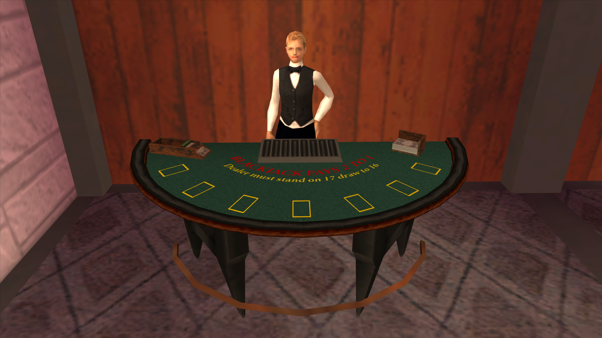
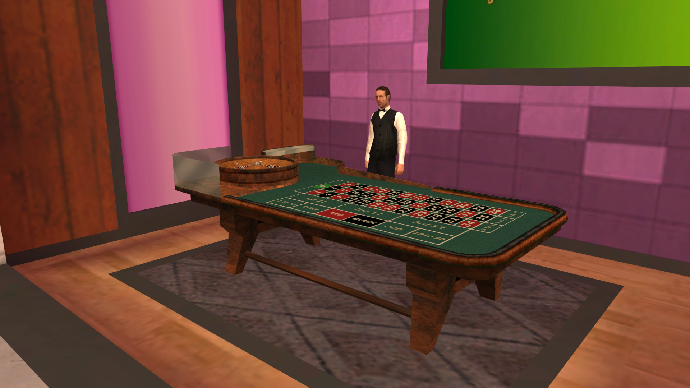
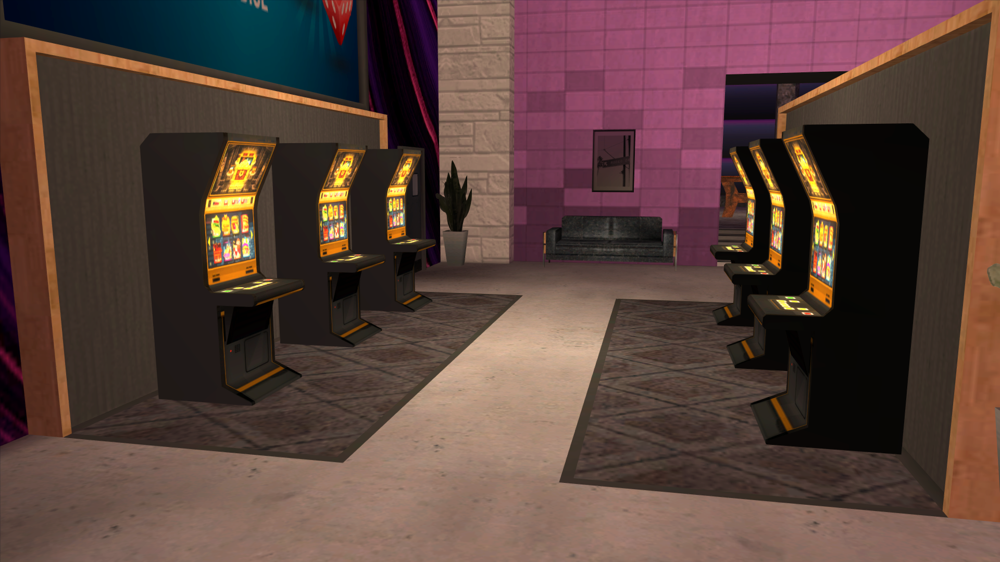
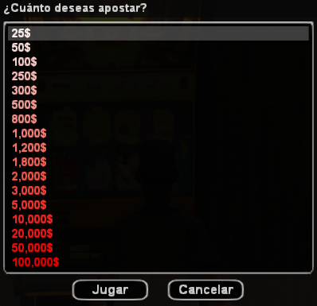
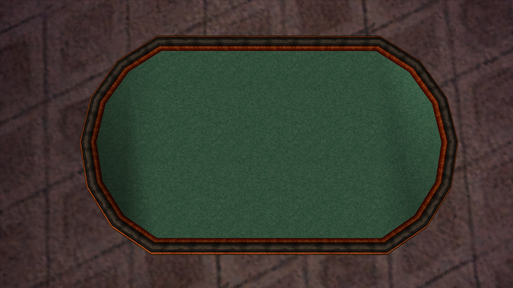

# Sistema de casino

## Introducción

El **Emerald Isle Casino** es el epicentro del entretenimiento y el lujo en San Andreas, en **Las Venturas**. Combina un bar, un restaurante, una terraza y amplias áreas de juego en un mismo espacio, pensado tanto para el roleplay social como para las grandes apuestas. Tiene aparcamiento propio y su propio ícono en el mapa.

Dentro del casino puedes jugar a las **tragamonedas**, la **ruleta** y el **blackjack**, todos ellos contra la casa. El **póker Texas Hold'em**, en cambio, ya no está atado al casino: cualquiera puede comprar una mesa como mueble y colocarla en cualquier propiedad. También encontrarás **apuestas hípicas (Inside Track)**, tanto en el casino como en las casas de apuestas repartidas por el estado.

Fuera del casino existen otras formas de jugar dinero: el **trile** callejero de Idlewood, la **lotería** estatal que se compra en cualquier supermercado y las partidas de billar apostado. Todas ellas comparten el mismo historial de ganancias y pérdidas.

> El casino está pensado como **entretenimiento de roleplay**. Apuesta con cabeza y define un presupuesto antes de empezar.

### Comandos

- `/casino` — muestra la ayuda del casino.
- `/casino slot` — te sienta en la máquina tragamonedas que tengas al lado.
- `/casino ruleta` — te sienta en la mesa de ruleta más cercana.
- `/casino blackjack` — te sienta en la mesa de blackjack más cercana.
- `/casino stats` — muestra tu balance histórico en cada juego de azar.
- `/poker` o `/pkr` — abre la ayuda del póker (funciona en cualquier propiedad con mesa).
- `/insidetrack` — abre la ayuda de las apuestas de caballos.
- `/loteria` — consulta el pozo acumulado, las horas de sorteo y tu número.

## Requisitos para jugar en el casino

- Necesitas tener activada la **verificación en dos pasos (2FA)** en tu cuenta. Sin ella, el casino no te dejará abrir ningún juego de la casa. Se activa desde el [panel de control](panel-de-control.md).
- No puedes jugar mientras estás usando el **teléfono**.
- No puedes jugar a dos juegos de azar a la vez: si ya estás en una máquina, una mesa o una partida, tienes que terminar antes de empezar otra.
- Debes estar **de pie y consciente** junto a la máquina o mesa correspondiente.

Este requisito de 2FA se aplica únicamente a los juegos que se abren con `/casino`. El póker, el trile, las apuestas hípicas y la lotería no lo piden.

---

## 1. Blackjack

El **blackjack** es un juego de cartas cuyo objetivo es sumar **21 puntos** o acercarte lo más posible sin pasarte, enfrentándote al crupier.

### Valor de las cartas

- Las cartas del **2 al 10** mantienen su valor numérico.
- **Jota (J), Reina (Q) y Rey (K)** valen 10 puntos cada una.
- El **As** vale 1 u 11 puntos, el que más te convenga en cada momento.

### Desarrollo de la mano

Al sentarte eliges tu apuesta y ocupas un asiento. Cuando la mesa arranca se reparten **dos cartas** a cada jugador y dos al crupier, una de ellas boca abajo. En tu turno puedes:

- **Pedir** otra carta para acercarte a 21.
- **Plantarte** y conservar la mano que tienes.

Si te pasas de 21 pierdes la apuesta de inmediato. Cuando todos han terminado, el crupier revela su carta oculta y **pide cartas hasta alcanzar al menos 17 puntos**, momento en el que se planta obligatoriamente.

### Resultados y pagos

El pago se calcula sobre tu apuesta e **incluye la devolución de lo apostado**. Es decir, un pago de x1.5 sobre una apuesta de $10.000 te devuelve $15.000, con una ganancia neta de $5.000.

| Resultado | Cómo se consigue | Pago |
|---|---|---|
| **Blackjack natural** | As + carta de valor 10 en tus dos primeras cartas | **x2** |
| **Victoria normal** | Superas al crupier sin pasarte, o el crupier se pasa | **x1.5** |
| **21 puntos** | Llegas justo a 21 con cualquier número de cartas | **x1.5** |
| **Six Card Charlie** | Llegas a 21 o menos usando **seis cartas** sin pasarte | **x1.5** |
| **Empate (push)** | Empatas con el crupier | Recuperas tu apuesta |
| **Derrota** | El crupier te supera o te pasas de 21 | Pierdes la apuesta |

El **Six Card Charlie** gana aunque el crupier no se pase: si consigues sostener seis cartas sin superar 21, la mano es tuya.

### Límites y tiempos

| Parámetro | Valor |
|---|---|
| Apuesta mínima | **$1.000** |
| Apuesta máxima | **$1.000.000** |
| Jugadores por mesa | **7** |
| Cartas máximas por mano | **6** |
| Tiempo por turno | **90 segundos** |
| Espera entre rondas | **10 segundos** |
| Mesas en el Emerald Isle | **3** |

No puedes abandonar la mesa mientras estés jugando una mano: primero termínala.

---

## 2. Ruleta

La **ruleta europea** es un juego de azar en el que apuestas al número, color o grupo en el que caerá la bola. La rueda tiene **37 casillas** (del 0 al 36), que alternan entre rojo y negro salvo el **0**, que es verde.

### Distribución de colores

| Color | Números |
|---|---|
| **Verde** | 0 |
| **Rojo** | 1, 3, 5, 7, 9, 12, 14, 16, 18, 19, 21, 23, 25, 27, 30, 32, 34, 36 |
| **Negro** | 2, 4, 6, 8, 10, 11, 13, 15, 17, 20, 22, 24, 26, 28, 29, 31, 33, 35 |

### Cómo se apuesta

Al sentarte se te asigna un **color de fichas** propio, para que distingas tus apuestas de las del resto de la mesa. Mueves un marcador por el tapete y colocas fichas sobre la casilla que quieras.

- Cada ficha vale **$1.000**.
- Puedes colocar todas las fichas que quieras, en tantas casillas como quieras, siempre que el total no supere el límite de la mesa.
- Puedes **retirar fichas** de una casilla o **cancelar todas tus apuestas** de golpe mientras la ruleta esté parada.
- Una vez que la rueda empieza a girar tus apuestas quedan bloqueadas: no puedes añadir, quitar ni cancelar nada.
- Cualquier jugador sentado puede lanzar la tirada cuando la mesa está lista.

### Tipos de apuesta y pagos

Los pagos se expresan en la forma habitual de la ruleta: **35:1** significa que cobras 35 veces tu apuesta más la apuesta devuelta.

| Apuesta | Números cubiertos | Pago | Probabilidad |
|---|---|---|---|
| **Pleno** (un número concreto, 0 incluido) | 1 | **35:1** | 2,70% |
| **Columna** (1ª, 2ª o 3ª) | 12 | **2:1** | 32,43% |
| **Docena** (1-12, 13-24, 25-36) | 12 | **2:1** | 32,43% |
| **Rojo** o **Negro** | 18 | **1:1** | 48,65% |
| **Par** o **Impar** | 18 | **1:1** | 48,65% |
| **1 a 18** (bajos) o **19 a 36** (altos) | 18 | **1:1** | 48,65% |

Las tres columnas del tapete son:

| Columna | Números |
|---|---|
| **Columna 1** | 1, 4, 7, 10, 13, 16, 19, 22, 25, 28, 31, 34 |
| **Columna 2** | 2, 5, 8, 11, 14, 17, 20, 23, 26, 29, 32, 35 |
| **Columna 3** | 3, 6, 9, 12, 15, 18, 21, 24, 27, 30, 33, 36 |

> **El 0 es especial.** Si la bola cae en el 0 ganan únicamente quienes lo hayan apostado en pleno. Las apuestas a rojo, negro, impar, docenas, columnas, bajos y altos **pierden**.

### Límites de la mesa

| Parámetro | Valor |
|---|---|
| Valor de cada ficha | **$1.000** |
| Apuesta máxima por mesa | **$1.000.000** |
| Mesas en el Emerald Isle | **2** |

El límite se aplica al **total** de todas tus fichas en la mesa, no a cada casilla por separado. Si intentas superarlo, el juego te avisa y no coloca la ficha.

---

## 3. Máquinas tragamonedas

Las **tragamonedas** son máquinas de azar en las que eliges una apuesta, giras tres rodillos y cobras si los tres muestran el mismo símbolo.

### Cómo se juega

1. Colócate junto a una máquina libre y usa `/casino slot`.
2. Elige tu apuesta en la lista que aparece.
3. Pulsa la **tecla de sprint** para girar.
4. Pulsa la **tecla de apuntar** para activar los **giros automáticos**, que repiten la misma apuesta sin que tengas que pulsar nada.
5. Pulsa la **tecla de entrar/salir de vehículo** para abandonar la máquina.

Cada máquina solo admite un jugador a la vez.

### Combinaciones y pagos

Para cobrar necesitas que los **tres rodillos** muestren el mismo símbolo. El multiplicador se aplica sobre tu apuesta.

| Combinación | Multiplicador |
|---|---|
| Doble barra de oro | **x25** |
| Barra de oro simple | **x10** |
| Campanas | **x5** |
| Cerezas | **x3** |
| Uvas | **x1,75** |
| Número 69 | **x0,5** |

Ojo con la última fila: el **69 paga la mitad de lo apostado**, así que aunque los tres rodillos coincidan, esa combinación sigue siendo una pérdida neta. Cualquier otra coincidencia es ganancia.

### Apuestas disponibles

Las máquinas ofrecen **17 tramos fijos** de apuesta:

**$25 · $50 · $100 · $250 · $300 · $500 · $800 · $1.000 · $1.200 · $1.800 · $2.000 · $3.000 · $5.000 · $10.000 · $20.000 · $50.000 · $100.000**

Los premios de **$5.000 o más** hacen sonar la máquina para todo el salón, y desbloquean un logro la primera vez.

### Sala de tragamonedas

El Emerald Isle dispone de **30 máquinas** distribuidas en su sala principal, en varias filas enfrentadas.

---

## 4. Trile (juego de la bolita)

El **trile** es un juego callejero, no forma parte del casino. Un buscavidas monta su mesa plegable en **Idlewood, Los Santos** y te reta a seguir la bolita bajo tres vasos.

### Cómo se juega

1. Acércate a la mesa; el juego te avisará por pantalla.
2. Pulsa la **tecla de entrar/salir de vehículo** para empezar y elige tu apuesta base.
3. Te enseñan bajo qué vaso está la bolita durante un momento; luego bajan los vasos y empiezan a mezclarlos.
4. Cuando se detienen, mueves la selección con las teclas de **izquierda y derecha** y confirmas con la **tecla de entrar/salir de vehículo**. Tienes **10 segundos** para elegir.
5. Si aciertas, cobras y **subes de nivel**. Si fallas, pierdes lo apostado en esa ronda y tu racha termina.

Entre rondas dispones de **15 segundos** para decidir: pulsa **ENTER** para seguir jugando el siguiente nivel, o la **tecla de sprint** para retirarte con lo ganado.

### Apuestas, niveles y pagos

Al entrar eliges una **apuesta base** entre **$25, $50, $100, $250, $500 y $1.000**. A partir de ahí, cada nivel superado multiplica esa base:

- **Nivel 1**: apuestas la base × 1.
- **Nivel 2**: apuestas la base × 2.
- **Nivel 3**: apuestas la base × 3… y así sucesivamente, sin tope de niveles.

Cada acierto paga **x2 sobre lo apostado en esa ronda**, es decir, duplicas la apuesta del nivel. Antes de cada ronda se te muestra exactamente cuánto vas a arriesgar y cuánto cobrarías.

| Nivel | Apuesta (base $100) | Pago si aciertas |
|---|---|---|
| 1 | $100 | $200 |
| 2 | $200 | $400 |
| 3 | $300 | $600 |
| 5 | $500 | $1.000 |
| 10 | $1.000 | $2.000 |

Necesitas tener el efectivo suficiente para cubrir la apuesta de cada nivel; si no lo tienes, la racha se detiene ahí.

### Dificultad

La mesa se complica a medida que avanzas:

| Parámetro | Comportamiento |
|---|---|
| Mezclas por ronda | **6 en el nivel 1**, una más por cada nivel |
| Velocidad de las mezclas | Empieza pausada y **acelera un 12% por nivel** |
| Fintas (amagos que no intercambian nada) | **20%** de los movimientos |
| Tiempo para elegir | **10 segundos** |

El ritmo inicial es deliberadamente pausado y las fintas son escasas, de modo que los primeros niveles se pueden seguir con la vista sin demasiada dificultad. Solo hay **una mesa** y admite **un jugador a la vez**.

---

## 5. Póker Texas Hold'em

El **póker Texas Hold'em** es una variante en la que recibes **dos cartas privadas** y se colocan hasta **cinco cartas comunitarias** sobre la mesa en tres fases: **flop** (3 cartas), **turn** (1 carta) y **river** (1 carta). En cada ronda de apuestas puedes **igualar**, **subir**, **pasar**, **retirarte** o ir **all-in**. Gana quien forme la mejor jugada de cinco cartas combinando sus cartas privadas con las comunitarias.

### Disponible en cualquier propiedad

A diferencia del resto de juegos, el póker **no se limita al Emerald Isle**:

- Cualquiera puede comprar una **mesa de póker** como mueble, por **$800**, desde el menú de muebles de la propiedad.
- Se puede colocar en **cualquier tipo de propiedad**: clubes, bares, casas, negocios, casinos privados…
- Pueden correr **varias partidas simultáneas** en el servidor, cada una con su propia mesa.

Esto habilita salas privadas, torneos caseros y clubes sociales. Consulta el [sistema de propiedades](sistema-de-propiedades.md) para ver cómo colocar y editar muebles.

### Baraja y jugadores

- Se juega con una **baraja de 52 cartas**.
- De **2 a 6 jugadores** por mesa.
- Orden de cartas de mayor a menor: **A, K, Q, J, 10, 9, 8, 7, 6, 5, 4, 3, 2**.
- Los palos **no tienen jerarquía** entre sí.

### Flujo de una partida

1. Acércate a la mesa y únete con `/pkr unirse`.
2. Compra fichas con `/pkr fichas`: el importe sale de tu efectivo y pasa a tu pila en la mesa.
3. Marca tu estado como **listo** desde la interfaz.
4. Cuando todos están listos, cualquiera inicia la partida con `/pkr comenzar`.
5. Durante las manos apuestas desde los botones centrales (subir, pasar, igualar, retirarse, all-in).
6. Al terminar, `/pkr siguiente` devuelve la mesa al lobby para una nueva ronda.

Los ajustes de la mesa (apuesta mínima, comisión, temporizador) **solo se pueden cambiar en el lobby**, nunca con una partida en curso. Al cambiarlos, todos los jugadores vuelven a estado "no listo" para que confirmen las nuevas condiciones.

### Comandos de jugador

- `/pkr ayuda` — lista todos los comandos.
- `/pkr unirse` — te unes a la mesa que tengas cerca.
- `/pkr sentarse` / `/pkr levantarse` — tomas o sueltas un asiento.
- `/pkr abandonar` — abandonas la partida.
- `/pkr fichas` — añades fichas a tu pila (solo en el lobby).
- `/pkr comenzar` — inicias la partida cuando todos están listos.
- `/pkr siguiente` — reinicias la mesa una vez terminada la partida.
- `/pkr spec` — observas una partida en curso.
- `/pkr cam` — alternas la vista de cámara.
- `/pkr mouse` — recuperas el cursor si lo pierdes.

### Comandos para dueños

| Comando | Qué ajusta | Rango |
|---|---|---|
| `/pkr apuesta` | Apuesta mínima (ciega) de la mesa | **$0 a $100.000** |
| `/pkr temporizador` | Tiempo máximo por turno | **10 a 60 segundos**, o 0 para desactivarlo |
| `/pkr comision` | Comisión de la casa sobre cada bote | **0% a 25%** |

La apuesta mínima y el temporizador los puede fijar cualquiera de los jugadores desde el lobby; el valor por defecto del temporizador es de **20 segundos**. La **comisión**, en cambio, solo la puede establecer el **dueño de un club** y se cobra dentro de ese club; el dinero va directo a la caja del negocio.

### Recursos para aprender

- [Tutorial de PokerStars](https://www.pokerstars.es/poker/games/texas-holdem/)
- [Tutorial de EducaPoker](https://www.educapoker.com/)
- [Entrada de Wikipedia sobre Texas Hold'em](https://es.wikipedia.org/wiki/Texas_hold_%27em)

---

## 6. Inside Track (apuestas de caballos)

El **Inside Track** son carreras de caballos retransmitidas por televisión sobre las que puedes apostar. Las encuentras en el propio Emerald Isle y en las **casas de apuestas** repartidas por el estado. Si usas el comando fuera de una, el juego te marca en el mapa la casa de apuestas más cercana.

### Cómo funciona

- Se corre una carrera nueva **cada 15 minutos**. `/insidetrack` te dice cuántos minutos faltan para la siguiente.
- Cada carrera enfrenta a **5 caballos** elegidos al azar del establo, con su jinete y su cuota.
- Abres el panel con `/insidetrack apostar`, eliges caballo e importe, y confirmas.
- Puedes seguir la carrera en directo con `/insidetrack spec` y cambiar de cámara con `/insidetrack cámara`.
- Mientras la carrera no haya empezado puedes retirar tu apuesta con `/insidetrack cancelar`.

### Dinero y pagos

- La apuesta sale de tu **cuenta bancaria**, no de tu efectivo, y el premio se ingresa también al banco.
- El importe debe estar entre **$1 y $1.000.000**.
- Cada caballo tiene una **cuota** visible en el panel, entre **x2 y x5**. Si tu caballo gana, cobras tu apuesta multiplicada por esa cuota; los caballos con cuota alta son los menos favoritos.
- Solo puedes tener **una apuesta confirmada** a la vez.

### Comisión de la casa

El dueño del negocio donde apuestas puede fijar una **comisión de entre 0% y 10%** con `/insidetrack rake`. Se descuenta de tu apuesta en el momento de confirmarla, va a la caja del negocio y **no se reembolsa** aunque canceles. El porcentaje vigente se muestra en el panel de apuestas antes de que confirmes.

### Comandos

- `/insidetrack apostar` — abre el panel de apuestas.
- `/insidetrack cancelar` — cancela tu apuesta antes de la carrera.
- `/insidetrack spec` — observas la carrera en curso.
- `/insidetrack cámara` — alternas la vista de cámara.
- `/insidetrack mouse` — recuperas el cursor.
- `/insidetrack salir` — sales de la retransmisión.
- `/insidetrack rake` — para dueños: fija la comisión de la casa.

---

## 7. Lotería de San Andreas

La **lotería estatal** es la apuesta más barata del servidor y no requiere estar en ningún local de juego.

### Cómo participar

- Compra tu boleto en **cualquier supermercado** del estado.
- Cada boleto te asigna un **número al azar entre 1 y 300**, así que tienes **1 probabilidad entre 300** de ganar.
- Solo puedes tener **un boleto activo**: si compras otro, sustituye al anterior.
- Consulta el pozo, las horas de sorteo y tu número con `/loteria`.

### Sorteos y premios

- Hay **tres sorteos al día**, a las **02:00, 04:00 y 15:00** (hora del servidor, consultable con `/hora ooc`).
- Se avisa por los medios **15 minutos antes** de cada sorteo.
- El número ganador se anuncia públicamente. Si es el tuyo, el pozo completo se ingresa en tu **cuenta bancaria**.
- Todos los boletos se anulan tras cada sorteo, ganes o no: hay que comprar uno nuevo para el siguiente.
- Si **nadie acierta**, el pozo crece y se acumula para el siguiente sorteo. Si alguien gana, el pozo se reinicia entre **$300.000 y $500.000**.
- El pozo también sube ligeramente con cada boleto vendido.

---

## 8. Estadísticas personales

Con `/casino stats` consultas en cualquier momento tu **balance neto de por vida** en cada juego: la suma de todo lo ganado menos todo lo apostado.

Se muestran por separado:

- Tragamonedas
- Ruleta
- Blackjack
- Póker
- Trile
- Inside Track
- Billar (8 Ball Pool)

El balance aparece en **verde** si vas en positivo y en **rojo** si vas en negativo, con un **total** al final que suma todos los juegos. Es la forma más rápida de saber si el casino te está tratando bien.

---

## 9. El casino como negocio

El Emerald Isle no es solo un lugar para jugar: es una propiedad con su propia caja. Todo lo que los jugadores pierden en las tragamonedas, la ruleta y el blackjack entra en la caja del casino, y todo lo que ganan sale de ella. Solo una parte de las pérdidas queda realmente en la caja: el resto **desaparece de la economía**, lo que ayuda a controlar la cantidad de efectivo en circulación en el servidor.

La caja del casino financia los premios de sus juegos, igual que la caja de cualquier casa de apuestas o club financia las comisiones del Inside Track y del póker. Puedes ver cómo funcionan las cajas de los negocios en el [sistema de propiedades](sistema-de-propiedades.md).

---

## Consejos

- **Fija un presupuesto antes de sentarte.** Todos los juegos de la casa están diseñados para que, a la larga, la casa gane: son una fuente de roleplay y de emoción, no una fuente de ingresos.
- **En las tragamonedas**, recuerda que la combinación del 69 paga menos de lo que apuestas. Las máquinas son el juego más rápido y también el que más fácilmente vacía un bolsillo con los giros automáticos activados.
- **En la ruleta**, las apuestas a color, par/impar y altos/bajos son las que más veces ganan; los plenos son los que mejor pagan. El 0 solo beneficia a quien lo apueste directamente.
- **En el blackjack**, la clave está en calcular cuándo el crupier se pasará: recuerda que está obligado a pedir hasta 17.
- **En el trile**, retirarte a tiempo es parte del juego. Cada nivel sube tu apuesta, así que una racha larga arriesga cada vez más dinero por la misma probabilidad de acierto.
- **En el Inside Track**, revisa la comisión de la casa antes de confirmar: no se devuelve aunque canceles la apuesta.
- **En el póker**, juegas contra otros jugadores y no contra la casa, así que tu habilidad y tu lectura de la mesa sí influyen en el resultado.
